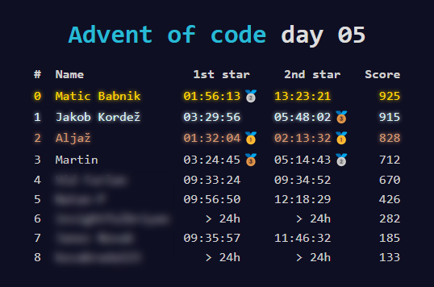

# Advent of Code Discord Webhook

Sends an image of an Advent of Code private leaderboard to a Discord server once a day.

Originally by [Martin Hanzlowsky](https://github.com/marwuint)

Updated by [Matic Babnik](https://github.com/MaticBabnik)



## Enviromental variables

Supports `.env` files.

```
WEBHOOK_URL=...
LEADERBOARD_ID=...
SESSION_ID=...
```

## Setup

### Simple

```sh
# Install dependencies
yarn

# Build
yarn build

# Start
yarn start
```

To override the CronJob and instantly send the leaderboard, use the `--now` flag.

```sh
yarn start --now
```

### Docker

```sh
# Build image
docker build -t aoc-webhook .

# Run
docker run -d --name aoc-webhook aoc-webhook
```

## Development / Debugging

To run the bot on a specific date, set the `date` variable in `index.ts`.

```ts
async function main() {
    const date = new Date(Date.UTC(2023, 11, 25));
    ...
}
```
